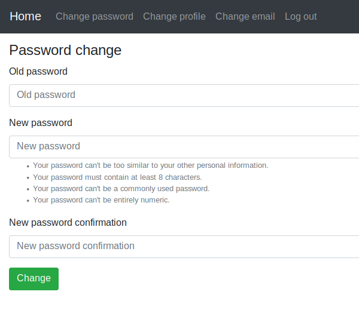

# Machine Learning Query System via Django
- This is an image classification system for HW1 of **Security and Privacy of Machine Learning**.
- Five adversarially trained models are provided for evaluating images uploaded by users.
    - Students need to generate adversarial examples (images) with enough attacking strength to make pre-trained models mis-classify.
    - Each submission is in **.zip** format containing no more than **500** images.
    - Each student has only 10 submissions per day.
- An csv file of the classification results on each submitted image will be provided after each submission.

    

# Users account settings
| Log In | Create an account | Authorized page |
| -------|--------------|-----------------|
|  |  |  |

| Password reset | Set new password | Password change |
| ---------------|------------------|-----------------|
|  |  |  |

# Installing
### Clone the repository
```=bash
    git clone https://github.com/shiannn/SPML-query-system.git
    cd SPML-query-system
```
### Create virtualenv
```=bash
    virtualenv -p <Path to Your Python> env
    source env/bin/activate
```
### Install dependencies
```=bash
    python -m pip install -r requirements.txt
```
### Apply migrations
```=bash
    python source/manage.py migrate
```
### Collect static files (only on a production server)
```=bash
    python source/manage.py collectstatic
```
# Run
```=bash
    python source/manage.py runserver
```

# Acknowledgement
The codebase of the repo is highly borrowed from Yehor Smoliakov
- https://github.com/egorsmkv
- https://github.com/egorsmkv/simple-django-login-and-register